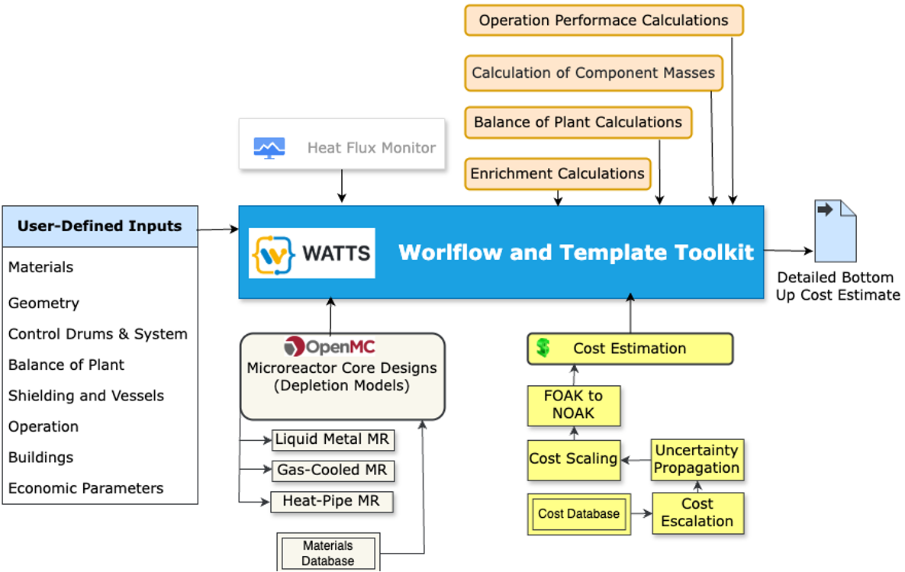

# Microreactor Optimization Using Simulation and Economics (MOUSE) 
## Motivation
The rising interest in nuclear microreactors has highlighted the need for comprehensive technoeconomic assessments. However, the scarcity of publicly available designs and cost data has posed significant challenges. The Microreactor Optimization Using Simulation and Economics (MOUSE) tool addresses this gap by integrating nuclear microreactor design with reactor economics.

## Description

MOUSE leverages the [OpenMC](https://github.com/openmc-dev/openmc) Monte Carlo Particle Transport Code to perform detailed core simulations for various microreactor designs, including Liquid Metal Thermal Microreactors (LMTR), Gas-Cooled TRISO-Fueled Microreactors (GCMR), and Heat Pipe Microreactors. It includes simplified balance of plant and shielding calculations. Economically, MOUSE provides bottom-up cost estimates, encompassing preconstruction, direct, indirect, training, financial, O&M, and fuel costs. It calculates total capital costs and the levelized cost of energy (LCOE) for both first-of-a-kind and nth-of-a-kind microreactors using data from the MARVEL project and additional literature.

## MOUSE Tool Structure

### User-Defined Inputs

- Overall System
Reactor Power (MWt), Thermal Efficiency (%), Heat Flux Criteria, Reactor Burnup Steps

- Geometry
Fuel Pin Radii, TRISO Packing Fraction, Coolant Channel Radius, Moderator Booster Radius, Lattice Pitch, Number of Rings per Assembly, Number of Assemblies per Core, Core Active Height, Reflector Thickness, Control Drum Radius, Control Drum Height, Control Drum Absorber Layer Thickness

- Materials
Fuel, Enrichment, Coolant, Reflector, Matrix Material, Moderator, Moderator Booster, Control Drum Absorber, Control Drum Reflector, Fuel Pin Materials

- Shielding
In Vessel Shield Thickness, In Vessel Shield Inner Radius, In Vessel Shield Material, Out Of Vessel Shield Thickness, Out Of Vessel Shield Material

- Vessels
Vessel Radius, Vessel Thickness, Vessel Lower Plenum Height, Vessel Upper Plenum Height, Vessel Upper Gas Gap, Vessel Bottom Depth, Vessel Material, Gap Between Vessel And Guard Vessel, Guard Vessel Thickness, Guard Vessel Material, Gap Between Guard Vessel And Cooling Vessel, Cooling Vessel Thickness, Cooling Vessel Material, Gap Between Cooling Vessel And Intake Vessel, Intake Vessel Material, Intake Vessel Thickness

- Balance of Plant
Coolant Inlet and Outlet Temperatures, Thermal Efficiency (%), Compressor Pressure Ratio, Pump Efficiency

- Operation
Operation Mode (autonomous or not), Number of Operators, Plant Lifetime, Refueling Period, Number of Emergency Shutdowns Per Year, Startup Duration after Refueling, Startup Duration after Emergency Shutdown, Number of Reactors Monitored Per Operator, Number of Security Staff Per Shift

- Buildings
Dimensions of Reactor Building, Dimensions of Turbine Building, Dimensions of Control Building, Dimensions of Refueling Building, Dimensions of Spent Fuel Building, Dimensions of Emergency Building, Dimensions of Storage Building, Dimensions of Radioactive Waste Building

- Economic Parameters
Interest Rate, Escalation Year, Construction Duration, Debt to Equity Ratio, Annual Return

MOUSE is powered by the Workflow and Template Toolkit for Simulation ([WATTS](https://github.com/watts-dev/watts)), developed by ANL, which facilitates parametric studies by integrating various code components.

### Microreactor Designs
Three reactor designs are included so far:
- Liquid-metal thermal microreactor (LTMR)
- Gas-cooled microreactor (GCMR)
- Heat pipe microreactor (HPMR): Its cost estimation is still under development
